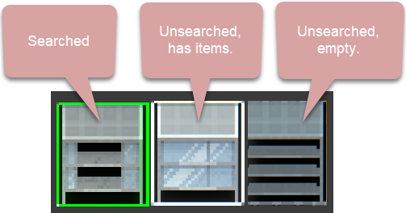

# Quasimorph Explored Outline



# Temporary Update

This is a temporary update to quickly provide 0.8.5 support.  There is an issue with corpses not highlighting based on explored state.  This is being researched.

# Info

This mod changes the outline of storage containers that have already been opened, even if they have items still in them.  By default the outline is green, but this can be configured.
Storage containers are items on the floor, cabinets, bodies, etc.

Unexplored and empty containers will still follow the normal game rules where white is unexplored and a light outline for empty.


# Configuration
The configuration file is located at ```%UserProfile%\AppData\LocalLow\Magnum Scriptum Ltd\Quasimorph_ModConfigs\QM-ChangeExploredColor\QM-ChangeExploredColor.json``` .
The file will be created the first time the game is run.

|Name|Default|Description|
|--|--|--|
|ExploredOutlineColor|Green = RGBA(0,1,0,1)|The outline color for items that have already been explored.|

# Support
If you enjoy my mods and want to buy me a coffee, check out my [Ko-Fi](https://ko-fi.com/nbkredspy71915) page.
Thanks!

# Source Code
Source code is available on GitHub https://github.com/NBKRedSpy/QM-ChangeExploredColor

# Change Log

## 1.4.0
* v0.8.5 compatible.
* Currently corpse highlights does not work.

## 1.3.0
Moved config file directory.

## 1.2.0
Fixed empty storage using the "explored" color instead of the default "clear" color.

## 1.1.0
Converted to Steam Workshop

