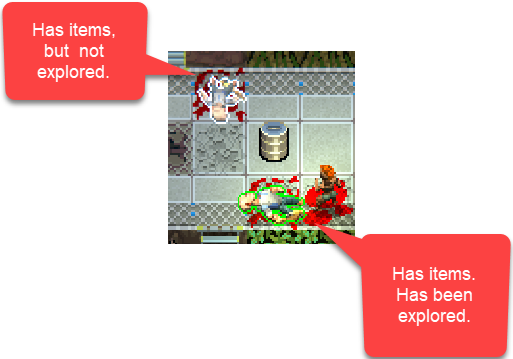

# Quasimorph Explored Outline

## Preface
The game is actively changing so this mod may break.
This mod will be moved to Steam Workshop shortly.

# Info

This mod changes the outline of storage containers that have already been opened, even if they have items still in them.  By default the outline is green, but this can be configured.
Storage containers are items on the floor, cabinets, bodies, etc.

Unexplored and empty containers will still follow the normal game rules.  White outline for unexplored, no outline for empty.




# Configuration
The configuration file is located at ```BepInEx/config/nbk_redspy.QM_ChangeExploredColor.cfg```
The file will not exist until the game is started.

|Name|Default|Description|
|--|--|--|
|ExploredOutlineColor|00FF00FF|The outline color for items that have already been explored.  Color format is RGBA|


# Installation

## BepInEx

If BepInEx 5 has been previously installed, skip to the [Mod Install](#mod-install) section.

1. Download the BepInEx utility from https://github.com/BepInEx/BepInEx/releases/download/v5.4.23.2/BepInEx_win_x64_5.4.23.2.zip
2. Extract the contents of the zip file into the game's directory, ```<steam directory>\steamapps\common\Quasimorph``` .
    - There will now be a ``BepInEx`` directory.
3. Run the game and exit once the main screen is shown.  This is required to setup BepInEx.
4. If BepInEx ran correctly, there should now be BepInEx\plugins directory in the game's directory.

## Mod Install
1. Download the QM-ChangeExploredColor.zip file from https://github.com/NBKRedSpy/QM-ChangeExploredColor/releases
2. Extract the zip file into the BepInEx\plugins directory.
3. Run the game.


# Installation Issues.

If the mod is not working and this is the first time BepInEx was installed, 99% of the time the files were copied to the wrong directory or the zip was decompressed by creating a directory.

When extracting the zip, make sure the BepInEx directory *in* the zip is used.  If there is a directory such as BepInEx_win_x64_5.4.23.1, the zip was not decompressed as specified.

After the mod is installed, the game's directory must have the directories and files listed below.  
If there is no ```BepInEx/plugins``` directory, make sure the game was run at least once.  Those folders will be created at that time.

Otherwise, redo the install process.

```
Quasimorph
|
│   Quasimorph.exe
│   winhttp.dll
│   
├───BepInEx
│   └───plugins
│       └───QM-ChangeExploredColor
│               QM-ChangeExploredColor.dll
│               
└───Quasimorph_Data
```


# Source Code
Source code is available on GitHub https://github.com/NBKRedSpy/QM-ChangeExploredColor
